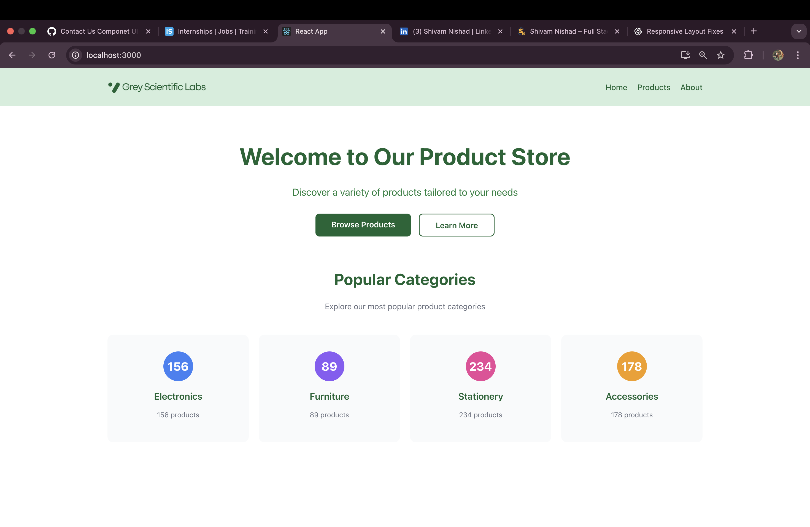
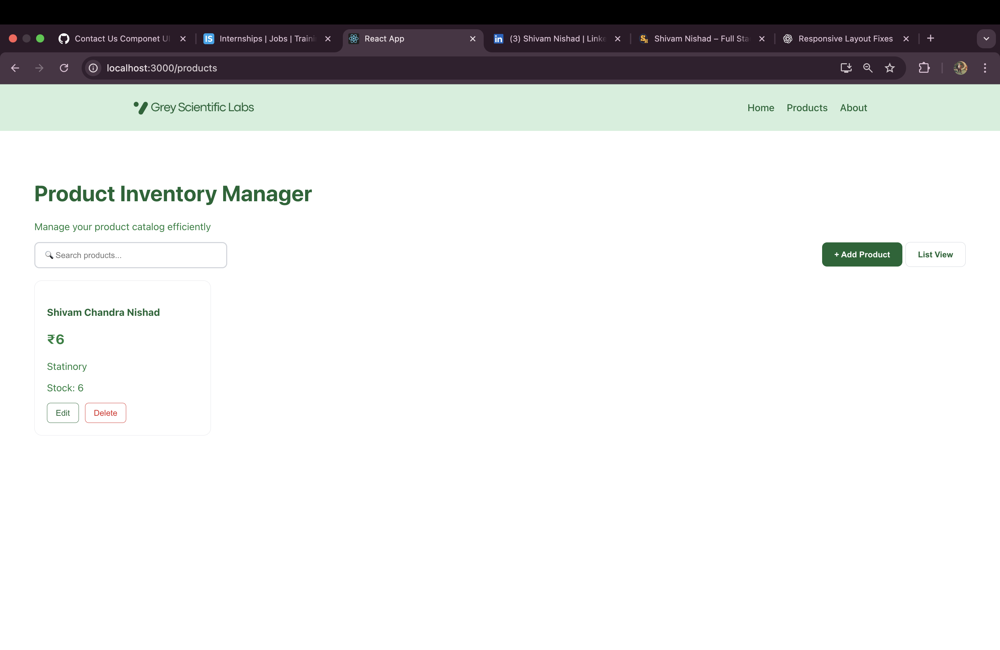
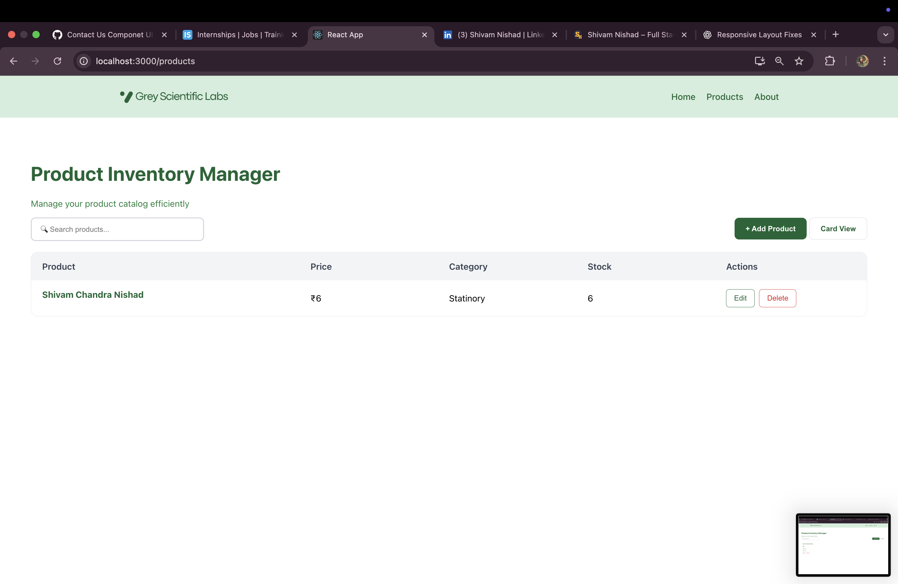
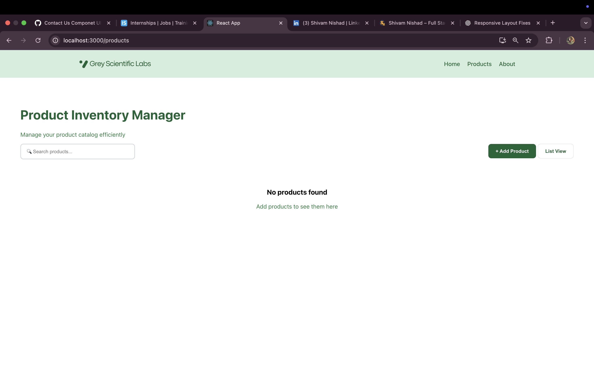
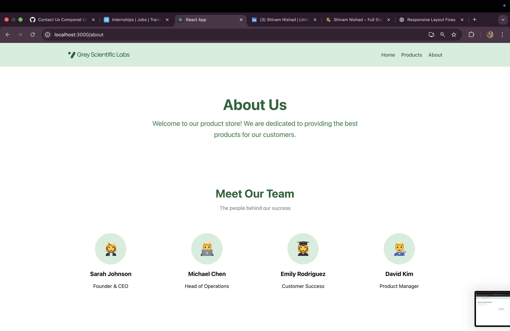
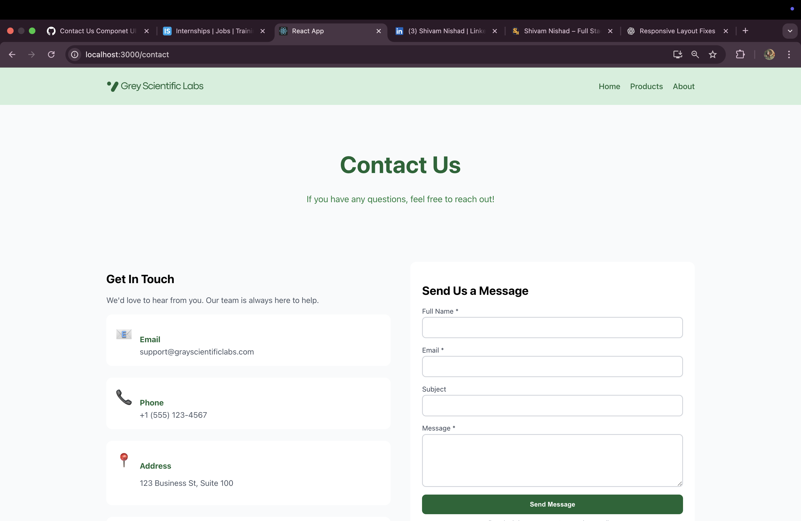
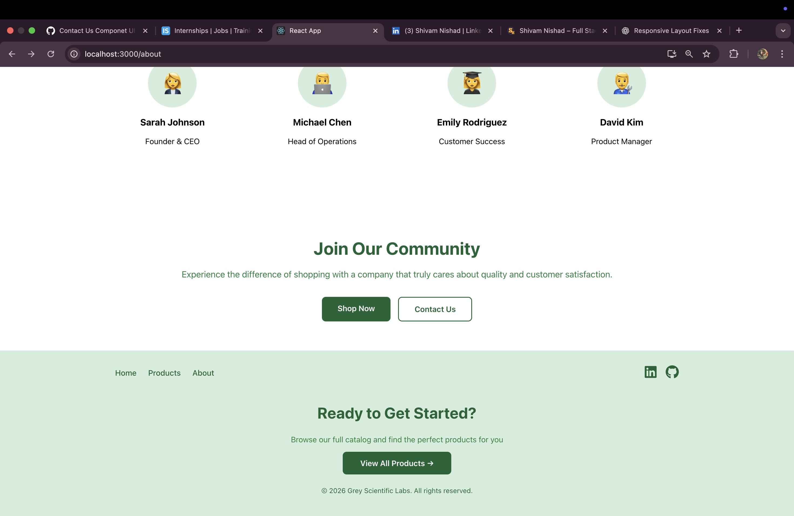

# Grey Scientific Labs Assessment (Products View)

This project was developed exclusively as part of the assessment provided by Grey Scientific Labs. It has been carefully prepared to meet the evaluation criteria mentioned in the assessment email.

Special emphasis has been placed on responsive design, ensuring a seamless user experience across desktop, laptop, and mobile devices, as responsiveness was a key requirement for qualifying for the interview process.

## Table of Contents

- [Features](#features)
- [Tech Stack](#tech-stack)
- [Project Structure](#project-structure)
- [Components](#components)
- [Styles](#styles)
- [Setup Instructions](#setup-instructions)
- [Usage](#usage)
- [Screenshots](#screenshots)

## Features

### Core Features
1. **Product Management**: Add, edit, and delete products
2. **Search**: Real-time search with debouncing
3. **Pagination**: Navigate through products (6 per page)
4. **View Modes**: Toggle between card and list views
5. **Form Validation**: Client-side validation with error messages

### Form Validation
- Name: Required field
- Price: Required, must be a positive number
- Category: Required field
- Stock: Optional, must be a number if provided

### Best Practices 
- Functional components and React hooks
- Modular component design
- Responsive design
- Error handling with user feedback
- Clean and maintainable code

## Tech Stack

| Layer | Technology |
|-------|------------|
| **Frontend** | React, React Router |
| **Styling** | CSS3 |
| **Other** | Create React App |

## Project Structure

```
products/
├── public/
│   ├── index.html
│   ├── manifest.json
│   └── robots.txt
├── src/
│   ├── components/
│   │   ├── Products.jsx
│   │   ├── About.jsx
│   │   ├── ContactUs.jsx
│   │   ├── Footer.jsx
│   │   ├── home.jsx
│   │   ├── Navbar.jsx
│   │   └── Searchbar.jsx
│   ├── styles/
│   │   ├── products.css
│   │   └── about.css
│   ├── data/
│   ├── assets/
│   │   └── logo.png
│   ├── App.jsx
│   ├── App.css
│   ├── index.js
│   ├── index.css
│   ├── reportWebVitals.js
│   └── logo.svg
├── package.json
└── README.md
```

## Components

### Products.jsx
Main product management component with:
- Product CRUD operations (Create, Read, Update, Delete)
- Search functionality with debounce (500ms)
- Pagination (10 items per page)
- Card and List view toggle
- Form validation with error messages

### Other Components
- **About.jsx**: About page
- **ContactUs.jsx**: Contact page
- **Footer.jsx**: Site footer
- **home.jsx**: Homepage
- **Navbar.jsx**: Navigation bar
- **Searchbar.jsx**: Reusable search component

## Styles

### products.css
Contains all styling for the Products page including:
- Card grid layout
- List view layout
- Form styling
- Pagination
- Responsive design

### about.css
Styles for the About page.

## Setup Instructions

### Prerequisites

- Node.js (v14 or higher)
- npm or yarn

### Installation

1. Navigate to the project directory:
   ```bash
   cd products
   ```

2. Install dependencies:
   ```bash
   npm install
   ```

3. Start the development server:
   ```bash
   npm start
   ```

The application will be available at `http://localhost:3000`

## Usage

### Adding a Product
1. Click "+ Add Product" button
2. Fill in the form:
   - Product Name (required)
   - Price (required, must be a number)
   - Category (required)
   - Stock (optional)
   - Description (optional)
3. Click "Add" to save

### Editing a Product
1. Click "Edit" on any product card/list item
2. Modify the form fields
3. Click "Update" to save changes

### Deleting a Product
1. Click "Delete" on any product
2. Confirm the deletion

### Searching
Use the search bar to filter products by name in real-time.

### Switching Views
Click "📋 List View" / "🎴 Card View" to toggle between view modes.

### Pagination
Use the numbered buttons at the bottom to navigate through pages.

## Screenshots

### Home Page


### Products Grid View


### Products List View


### Product Display


### About Page


### Contact Us Page


### Footer



